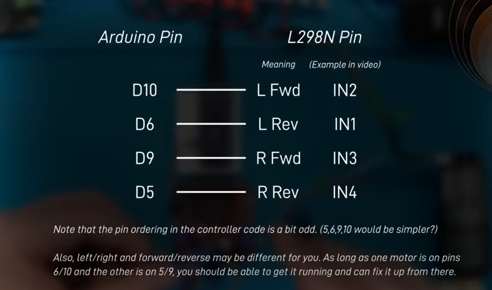
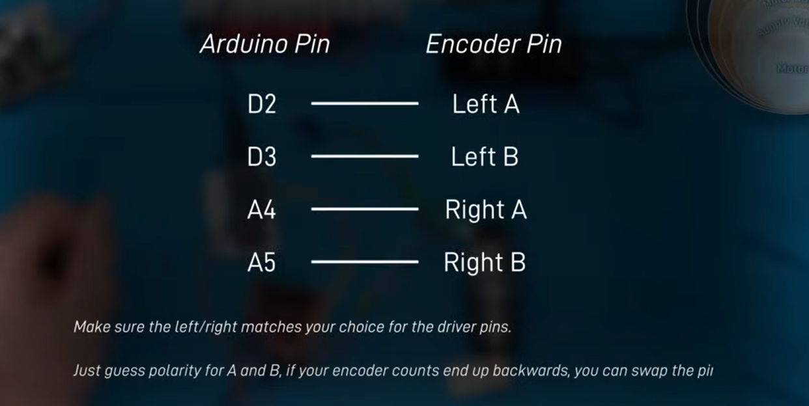

# Arduino Motor Controller

This code turns an Arduino into a motor controller!
It provides a simple serial interface to communicate with a high-level computer (e.g. running ROS), and generates the appropriate PWM signals for a motor driver, to drive two motors.

This is a fork of the original code, with some changes, and removal of the ROS nodes (see [this repo](https://github.com/joshnewans/serial_motor_demo) for an alternative). Check out `README-orig.md` for the original README.

## Pin Connections:
The pins for the DC motors are as follows if using an L298N. We are using the Grok Motor Driver listed in the Hardware list in the main git dir. 

Below are the pin mappings for the motor encoders to the Arduino. The pins can be adjusted by changing the pin number within the source code.

## Functionality

The main functionality provided is to receive motor speed requests over a serial connection, and provide encoder feedback.
The original code has provisions for other features - e.g. read/write of digital/analog pins, servo control, but I've never used them.

The main commands to know are

- `e` - Motor responds with current encoder counts for each motor
- `r` - Reset encoder values
- `o <PWM1> <PWM2>` - Set the raw PWM speed of each motor (-255 to 255)
- `m <Spd1> <Spd2>` - Set the closed-loop speed of each motor in *counts per loop* (Default loop rate is 30, so `(counts per sec)/30`)
- `p <Kp> <Kd> <Ki> <Ko>` - Update the PID parameters

## Gotchas

Some quick things to note

- There is an auto timeout (default 2s) so you need to keep sending commands for it to keep moving
- PID parameter order is PDI (?)
- Motor speed is in counts per loop
- Default baud rate 57600
- Needs carriage return (CR)
- Make sure serial is enabled (user in dialout group)
- Check out the original readme for more

## TODO (maybe)
- include bash file for adding user to the dialout group and automated setup for use of this lib. Maybe turn into a docker container. 
- change from carriage return to newline. 
- increase the baude rate for higher response which is necessary for higher speeds.
- consolidate READMEs
- Document PID tuning
- Make the speed input counts per second
- Add/test more driver boards